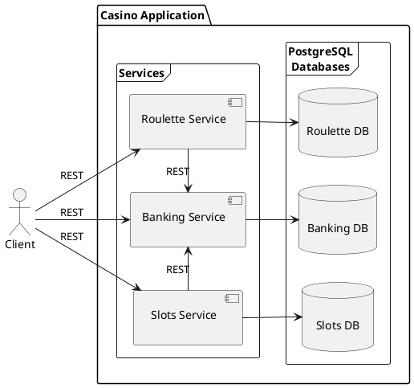
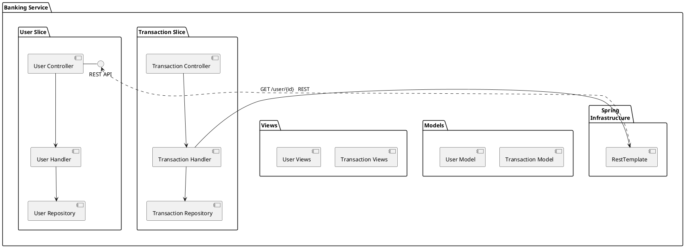
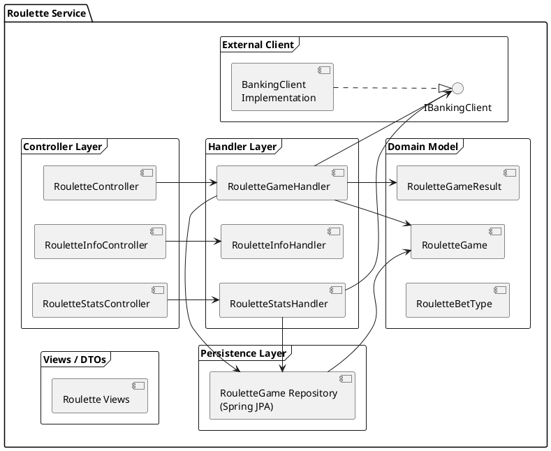
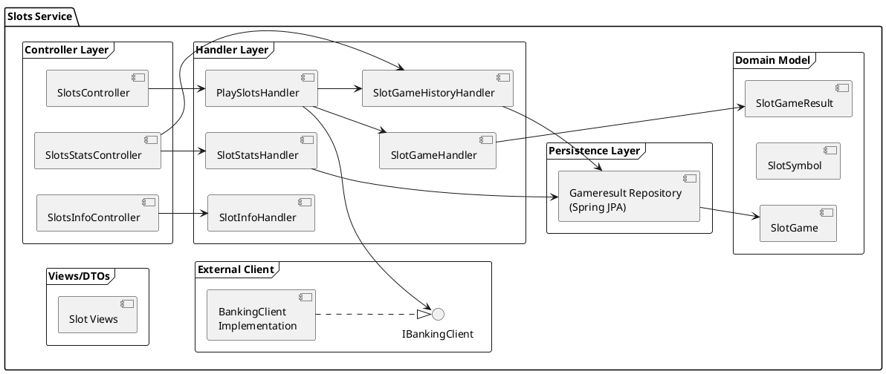

# PlantUML Component Diagrams

## Entire Application

### Rendered Image

### PlantUML Code

> [!NOTE]
> If you have a Markdown extension installed in your code editor/IDE or your browser, the extension may render an image from the PlantUML code automatically.

___

## BankingService

### Rendered Image

### PlantUML Code

> [!NOTE]
> If you have a Markdown extension installed in your code editor/IDE or your browser, the extension may render an image from the PlantUML code automatically.

___

## RouletteService

### Rendered Image

### PlantUML Code

> [!NOTE]
> If you have a Markdown extension installed in your code editor/IDE or your browser, the extension may render an image from the PlantUML code automatically.

---

## SlotsService

### Rendered Image

### PlantUML Code

> [!NOTE]
> If you have a Markdown extension installed in your code editor/IDE or your browser, the extension may render an image from the PlantUML code automatically.

